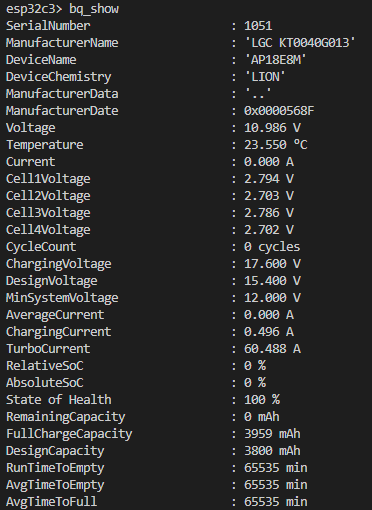
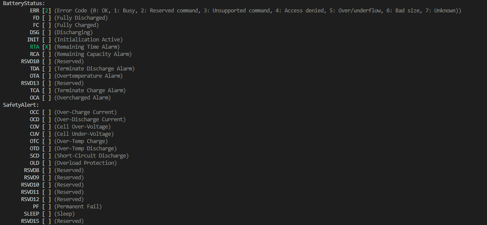
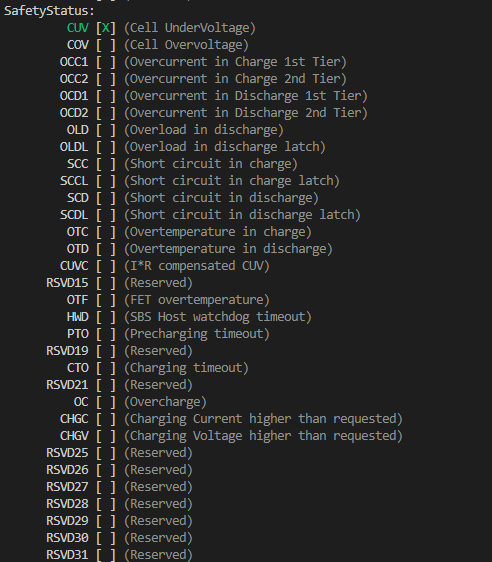
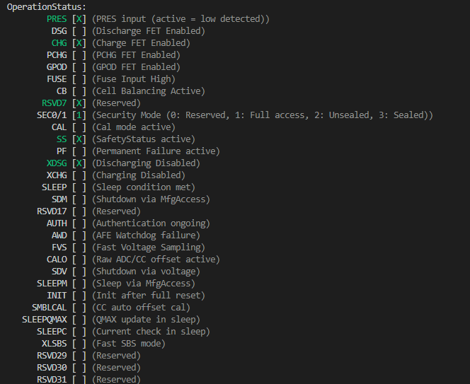
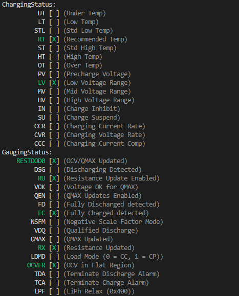
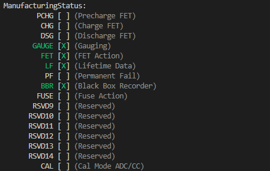
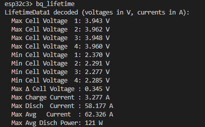
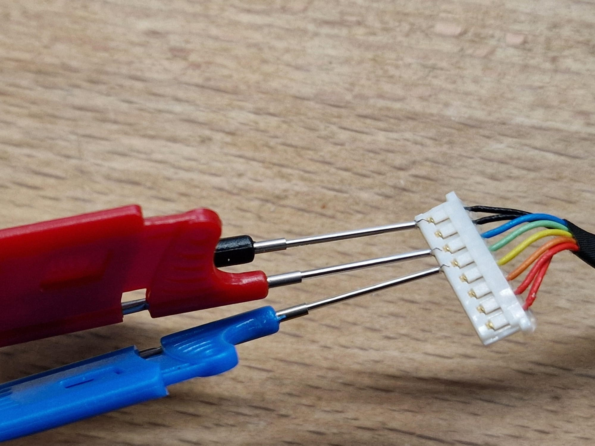
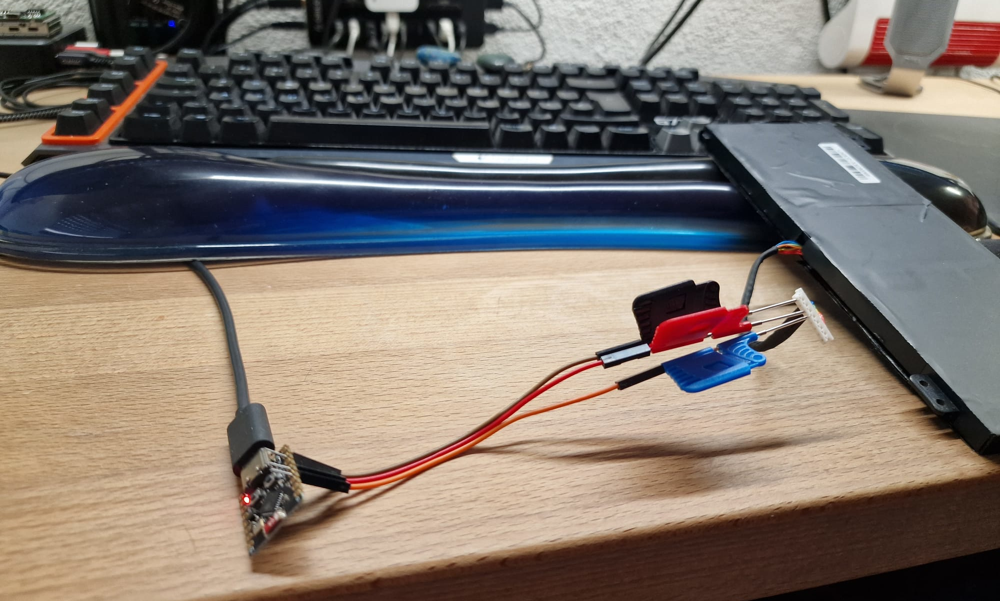

#     esp32_battgauge_tool: ESP32 I2C Command-Line Tool for battery gauge chips

This project, `esp32_battgauge_tool`, is an ESP-IDF application that provides a versatile command-line interface over Telnet for interacting with I2C devices using an ESP32.
It was initially created as a helper to read and write data from the TI BQ40Z555 battery gauge, which is commonly used in certain Acer battery packs.

I made heavy use of LLMs like ChatGPT-o3 and Gemini 2.5 Pro to speed up my programming here. It's a huge time saver to just not implement a commandline arg parser the 100th time by hand :)

## Story
I received a notebook which was said to have trouble charging the battery. Power supply and battery were swapped and still no charging.
When checking, the battery didn't supply any voltage when plugged into the laptop.
I tore the battery down and all cells were quite low, that's why the battery controller denied voltage supply.

Tried to charge the cells and still the controller didn't give me any voltage.

Checking the interwebs, I only could find the NLBA1 or other commercial tools to get deeper into the root of my problems here.
So the rabbit hole began...

## What can it do?
You can only read the current status bits, voltages, history data and such.
The chip might be locked into a secure mode, so you can not write data to it, but thats not the use case here.
So no actions were taken to crack the key required for unsealing and such.

## Features

*   **Wi-Fi Telnet Access:** A command-line shell accessible over Wi-Fi via any standard Telnet client.
*   **Generic I2C Commands:**
    *   `i2cscan`: Scans the I2C bus to discover connected devices.
    *   `i2c_r`: Reads a specified number of bytes from any I2C device.
    *   `i2c_w`: Writes one or more bytes to any I2C device.
    *   `i2c_rw`: Performs a combined write-then-read operation, ideal for accessing device registers. This command also supports cyclic execution for repeated polling.
*   **TI BQ40Z555 Gas Gauge Support:**
    *   `bq_show`: Dumps all known registers and status fields from the BQ40Z555, providing a comprehensive overview of the battery's state.
    *   `bq_lifetime`: Decodes and displays lifetime data blocks from the device, offering insights into its long-term usage and health.

## Getting Started

1.  **Hardware:** An ESP32 development board.
2.  **Software:** Requires the ESP-IDF (Espressif IoT Development Framework).
3.  **Configuration:**
    *   Enable WPS
    *   Define the I2C pins (SDA and SCL) in `main/gpio_config.h` to match your hardware setup.
4.  **Build and Flash:**
    ```bash
    idf.py build
    idf.py -p (YOUR_SERIAL_PORT) flash
    ```
5.  **Connect:**
    *   After flashing, the ESP32 will connect to your Wi-Fi network and print its IP address to the serial monitor.
    *   Use a Telnet client to connect to the device:
    ```bash
    telnet <ESP32_IP_ADDRESS>
    ```

## Example Usage

Once connected via Telnet, you can issue commands directly to your I2C devices:

```
# Scan for all I2C devices on the bus
i2cscan

# Read 2 bytes from a device at address 0x0B
i2c_r 0x0b -n 2

# Write the byte 0x01 to a device at address 0x0B
i2c_w 0x0b 0x01

# Read all available data from a BQ40Z555 gas gauge
bq_show
```


## Images











